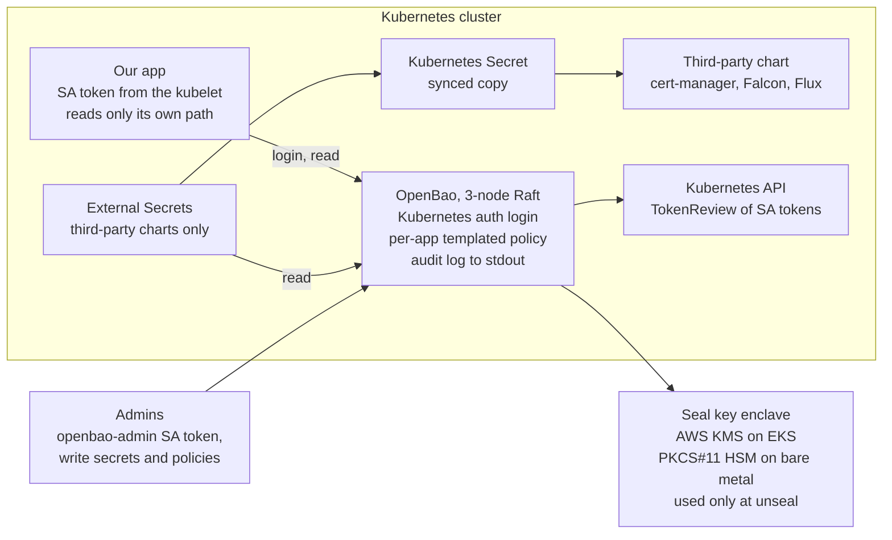

# ADR: Secrets management for Kubernetes apps

Date: 2026-10-01

## Status and context

**Status: proposed.** Today every secret is SOPS+age ciphertext in git, so the repo plus one age private key decrypts every secret ever committed. If an age key leaks, everything ever encrypted to it must be rotated, git history included.

- **How it works now:** humans hold the age private key on their laptops to edit secrets. Flux's kustomize-controller decrypts with the `sops-age` Secret and writes ordinary Kubernetes Secrets, which apps read as env vars or files.
- **What the discussion established:** every encrypt-at-rest scheme reduces to a key plus ciphertext, and an attacker holding both reads everything. Options differ in how hard each half is to obtain, whether the key can be revoked, and whether access is per-app and audited.
- **Already solved elsewhere:** CNPG databases use client-certificate auth, and AWS access uses IRSA (OIDC). AWS needs nothing from a secret manager. CNPG's client keys are still mounted Secrets, which Database access (under Decision) addresses. What remains are static third-party credentials, such as the CrowdStrike and Cloudflare API tokens.
- **Goal:** our apps read their secrets directly from a secret manager, under their own identity.

## Requirements

All four must hold. An option that misses any one is rejected.

| ID | Requirement | Why |
| --- | --- | --- |
| R1 | The encryption key lives in a secure enclave: a KMS or an HSM. | The key never exists as a file that can be copied, and every use of it can be logged and revoked. |
| R2 | Apps read their secrets from the secret manager's API, not from env vars, mounted files or Kubernetes Secrets. | Nothing lands in etcd, `/proc/*/environ` or crash dumps. Values rotate without a redeploy, and each read is audited per app. |
| R3 | Apps have no stored credential for reaching the secret manager. | They authenticate with their workload identity (a Kubernetes ServiceAccount token), so there is no first secret to protect. |
| R4 | The software is free and open source. | No licence cost or vendor lock-in, and it runs the same on EKS and bare metal. The enclave itself is hardware or a cloud service, so R4 applies to the software only. |

Scope: R2 covers our own apps. Third-party charts (cert-manager, Falcon, Flux) read env vars or files and can't call a secret manager. For those, R1, R3 and R4 still apply.

## Options considered

Only OpenBao, with apps calling its API, meets all four requirements. AWS Secrets Manager meets every requirement except R4.

| Option | R1 key in KMS/HSM | R2 apps read directly | R3 no stored credential | R4 free, open source | Notes |
| --- | --- | --- | --- | --- | --- |
| **OpenBao, apps call its API** | Yes: AWS KMS seal, or a PKCS#11 HSM seal | Yes | Yes: Kubernetes auth with the app's ServiceAccount token | Yes (MPL-2.0) | Chosen. We run it ourselves. |
| SOPS + age (today) | No: the private key is a file on laptops and in the `sops-age` Secret | No: Flux writes Kubernetes Secrets | No: the `sops-age` Secret | Yes | The repo plus one key exposes every secret in git history. |
| SOPS + AWS KMS | Yes | No | Partly: Flux decrypts through IRSA, apps never touch it | Yes; the KMS is AWS's | No key file, revocable, and humans can be encrypt-only. Ciphertext stays in git. Good interim fix. |
| OpenBao + ESO ([PR #116](https://github.com/devopscoop/fluxcd-template/pull/116)) | Yes | No: ESO writes Kubernetes Secrets | Yes | Yes | One ESO identity reads everything. A larger attack surface than SOPS + KMS for little gain. |
| AWS Secrets Manager + IRSA | Yes: customer-managed KMS key | Yes | Yes: IRSA | No: proprietary, about $0.40 per secret per month, AWS only | Best choice if R4 is dropped and we stay EKS-only. |
| [1Password service accounts](https://www.1password.dev/service-accounts/get-started.md) | No: 1Password's own key hierarchy | Yes: SDKs, or a Connect server | No: a service account token, shown once and stored | No | Good for humans; apps need a stored token. |
| [Bitwarden Secrets Manager](https://bitwarden.com/help/secrets-manager-kubernetes-operator/) | No: end-to-end encrypted, key material in the access token | Yes: SDKs | No: a machine account token in a Kubernetes Secret | No: Bitwarden licence; Vaultwarden doesn't implement it | No workload identity login. |
| [Infisical](https://infisical.com/docs/self-hosting/guides/hsm-integration) | Enterprise only: HSM or changed encryption strategy | Yes | Yes: Kubernetes auth | Partly: MIT core | Fails R1 on the free tier. |

Rejected seal modes for OpenBao: a static key in a Kubernetes Secret fails R1. A Shamir seal meets R1 only by keeping the key in people's heads, and every pod restart then needs humans to unseal it.

## Decision

We adopt OpenBao (MPL-2.0) as the secret manager. Apps read secrets through its API as their own Kubernetes ServiceAccount, and its seal key lives in AWS KMS on EKS or in a PKCS#11 HSM on bare metal.



Apps log in with their own ServiceAccount token and read only their own path. ESO serves third-party charts only. OpenBao calls the enclave only to unseal.

- **Deployment:** a 3-node Raft cluster, TLS from a private cert-manager CA, and a stdout audit device, as already built and tested in PR #116.
- **Seal (R1):**
  - EKS: AWS KMS through the `kms-aws` plugin. The key policy allows only OpenBao's IRSA role.
  - Bare metal: a PKCS#11 HSM such as a Nitrokey HSM 2, through the `kms-pkcs11` plugin. Either one HSM per node with the key cloned between them, or one HSM on a small separate OpenBao that auto-unseals the cluster through the `transit` seal.
- **Authentication (R3):** the Kubernetes auth method, accepting ServiceAccount tokens minted by the kubelet for the `openbao` audience. Nothing is stored in the app.
- **Authorization:** one templated policy confines app `<namespace>/<serviceaccount>` to its own path, so adding an app needs no OpenBao change:

```hcl
path "secret/data/{{identity.entity.aliases.<k8s-auth-accessor>.metadata.service_account_namespace}}/{{identity.entity.aliases.<k8s-auth-accessor>.metadata.service_account_name}}/*" {
  capabilities = ["read"]
}
```

- **Apps (R2):** call the API with OpenBao's Go client or any Vault-compatible client. Cache values, refresh them on a TTL, and survive brief outages.
- **Third-party charts:** cert-manager's Cloudflare token, the Falcon Helm values and Flux's GitHub App key reach their charts through ESO, read from OpenBao.
- **Configuration as code:** `bao operator init` runs once, then the idempotent `configure.sh` applies mounts, auth, policies and roles from git. Never use the `initialize` self-init stanza: with Raft `retry_join` it split the cluster in testing (openbao/openbao#3652).
- **Humans:** admins log in with short-lived tokens for the `openbao-admin` ServiceAccount, so admin access follows Kubernetes RBAC. Recovery keys go in the password manager and are used only for break-glass.

### Database access

Apps keep CNPG's client-certificate auth but get short-lived certs from OpenBao's PKI engine through the API. Today's cert-manager client key is a Secret mounted as files, which fails R2.

| Aspect | cert-manager client cert (today) | OpenBao PKI engine (chosen) | OpenBao database engine (fallback) |
| --- | --- | --- | --- |
| Credential | Long-lived key in a mounted Secret | Short-lived client cert (for example 1 h); the key is generated in the app's memory | Short-lived password for a role created on demand |
| Meets R2 / R3 | No / yes | Yes / yes | Yes / yes |
| pg\_hba | `hostssl all <role> all cert` | Unchanged | Adds `hostssl app +bao_dynamic all scram-sha-256` |
| Role churn, ownership problems | No | No | Yes: migrations must run as a fixed owner role |
| Drivers | Any | In-memory certs: Go pgx, JDBC, node-postgres | Any, including libpq (psql, psycopg) |

- **How it works:** one PKI mount per database, whose CA certificate goes into the bundle in CNPG's `clientCASecret`. The app sends a CSR to its own PKI role and gets back a cert whose CN is its Postgres role. Each app may sign only for its own role.
- **Replication:** the `streaming_replica` cert stays on cert-manager. `clientCASecret` carries both CAs in one `ca.crt` bundle. Verify this in the pilot.
- **Outage tolerance:** TLS checks the cert only at the handshake, so open connections survive an OpenBao outage. New connections fail once the cert expires, so pick the TTL (1 h to 24 h) by how long OpenBao may be down. Renew at about two thirds of the TTL.
- **Fallback:** clients that need cert files on disk (libpq-based) use the database secrets engine instead. OpenBao creates a role with `VALID UNTIL` for each lease and drops it at expiry. Its own admin login is rotated with `rotate-root`, so only OpenBao knows it.
- **Humans:** no change. PostgreSQL OAuth through dex (the `pg-oauth` marker) still covers developer logins.

## Consequences

A leaked repo or laptop no longer exposes any secret, at the cost of running a tier-0 service and a larger online attack surface.

### Positive

- No secret values or ciphertext in git. A repo leak exposes paths at most.
- The seal key can't be copied. Revoking KMS access, or removing the HSM, makes stolen Raft data and snapshots useless from then on.
- Each app reads only its own secrets, and every read is audited. After an incident, we rotate only what was read.
- Values rotate without a redeploy, and our apps' secrets never touch etcd, env vars or files.
- The same setup works on EKS and bare metal, with no licence cost.

### Negative and risks

- **We operate a tier-0 service.** That means upgrades (the StatefulSet uses `OnDelete`), Raft snapshot backups and monitoring. An outage blocks app startups, so apps must cache.
- **Larger online attack surface than SOPS:**
  - OpenBao's API and its CVEs (2025 brought a batch of auth bypasses across Vault and OpenBao).
  - The admin identity: whoever can mint `openbao-admin` tokens or create pods in the `openbao` namespace.
  - The recovery keys.
- **Node compromise:** unsealed nodes hold the decrypted keyring in memory, so root on an OpenBao node exposes everything. Cluster-admin compromise still exposes everything, as it does today.
- **App changes:** every app needs an OpenBao client, caching and error handling.
- **Key loss is data loss:** never delete the KMS key, and back up HSM key material (for example the Nitrokey DKEK shares).
- **Bare-metal hardware:** an HSM per node with USB passthrough, or a separate unseal box.
- **Manual bootstrap:** `bao operator init` stays a one-time manual step until openbao/openbao#3652 is fixed.

### What this does not fix

- Static third-party credentials stay static. If one leaks, it still has to be rotated.
- Old SOPS ciphertext stays in git history forever. If an age key has ever leaked, everything encrypted to it must be rotated regardless.

## Implementation plan

We take age keys out of the picture first with SOPS + KMS, then move apps to OpenBao one at a time.

- [ ] **Interim:** switch SOPS from age to AWS KMS. Flux decrypts through IRSA, and humans get encrypt-only. Run `sops updatekeys`, then, if an age key may have been exposed, rotate every secret it could decrypt.
- [ ] **aws-eks-template:** add the KMS key `alias/openbao-<cluster>` and the IRSA role `openbao` (`kms:Encrypt`, `kms:Decrypt`, `kms:DescribeKey`).
- [ ] **Rework PR #116:**
  - Replace the single ESO identity with the templated per-app role. Keep ESO only for third-party charts.
  - Enable the chart's snapshot agent (Raft snapshots to S3).
  - Add the PKCS#11 / transit seal option for bare metal.
- [ ] **Pilot:** one app reads its secrets through the OpenBao API with caching. Document the client pattern.
- [ ] **Database access:** add an OpenBao PKI intermediate CA per database, trusted through CNPG's `clientCASecret`. Move one app's client cert to it, then the rest.
- [ ] **Migrate:** move the remaining app secrets one app at a time, rotating each on migration.
- [ ] **Revisit self-init** once openbao/openbao#3652 is fixed.

## References

- [fluxcd-template PR #116](https://github.com/devopscoop/fluxcd-template/pull/116): OpenBao + ESO, tested on an IPv6-only kind cluster.
- [openbao/openbao#3652](https://github.com/openbao/openbao/issues/3652): self-init bootstraps a new Raft cluster instead of honouring `retry_join`.
- [OpenBao seal configuration, v2.7.0](https://github.com/openbao/openbao/blob/v2.7.0/website/content/docs/configuration/seal/index.mdx): KMS seals are plugins since 2.7.
- [Infisical HSM integration](https://infisical.com/docs/self-hosting/guides/hsm-integration): Enterprise only.
- [Bitwarden Secrets Manager Kubernetes operator](https://bitwarden.com/help/secrets-manager-kubernetes-operator/): uses a machine account token stored in a Secret.
- [1Password service accounts](https://www.1password.dev/service-accounts/get-started.md): token-based, shown once.
